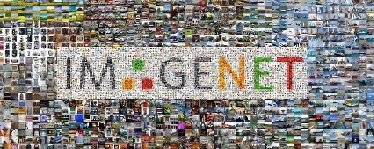

footer: Factor AI. 2019.
slidenumbers: true
slide-transition: fade(0.4)
autoscale: true

# [fit] Practical Deep Learning for Healthcare

**Sooheon Kim, Paul Warren**


*2019/11/7*

sooheon@factor.ai
paul@factor.ai

^안녕하십니까? 저는 김수헌, 이쪽은 제 파트너 폴 워렌입니다. 저희 함께
이제 1년 가까이, 다양한 Applied AI 프로젝트를 진행해온 consultancy인
Factor를 운영하고 있습니다.

^오늘 강의의 제목은 practical dl in hc입니다. 이 강의를 들으신 후,
딥러닝에 대한 실용적인 노하우, 그리고 실무에 바로 적용하실 때 이런
테크닉의 실질적 장단점을 한단계 더 잘 이해하실 수 있도록
노력해보겠습니다.

---

# Table of Contents

1. Understanding Deep Learning through **Computer Vision**
- DL's Superpower: **Transfer Learning**
  - Code examples
- Big Data **Stewardship**
- Q&A

^일단 간단하게 언제, 어떤 종류의 문제에 딥러닝이 적합한 것인지 설명
드리고, 딥러닝에서 가장 중요한 개념 중 하나인 transfer learning에 대한
설명을 드리겠습니다. 또한 데이터 스튜어드십의 최근 현황에 대해 말씀
드리고 마무리 짓겠습니다

^얼마든지 도중에 질문은 환영합니다.

---

# Why Deep Learning?

    

^딥러닝을 통해 2016년의 알파고에서 부터 최근 알파스타가 스타크래프트의
최고 랭크에 등극하기 까지 했습니다. 

^수많은 분야에서 놀라운 퍼포먼스를 보여주어, AI, Deep Learning기법은
당연히 가장 좋다

--- 

# 1. Understanding Deep Learning Through *Computer Vision*


---

# Original Task: 1966

- MIT professor: 

	>"Teach a computer to interpret images, it should take a summer"

- Resulted in AI winter


---

# ImageNet

- 2012: human level performance for first time

 

---

# Trends

1. **Big Data**
2. Better Computers
3. Smarter Algorithms


---

# Trends

1. Big Data
2. **Better Computers**
3. Smarter Algorithms


 

----

# Trends

1. Big Data
2. Better Computers
3. **Smarter Algorithms**


---

# What do Deep Learning Models Look Like?

^**Automatic reuse** of learned "hidden representations"–i.e. shared weights.


^Each number is a separate task, but sharing weights allows statistical power to be shared.

---


---

# Evolution of CV Tasks


---

# 2. Deep Learning's Superpower: *Transfer Learning*


---

# Types of Transfer learning

*Sequential*

- Big data → small dataset
- Common task → unique task
- Curriculum learning

*Parallel*

- Multi-task learning

---

# Transfer Learning By Examples

**Computer Vision**

- ImageNet → IGV tumor classification

**Regression**

- QSAR multi-task prediction

**Natural Language Processing**

- WikiText103 → Oncologist Language Model
- WikiText103 → Oncologist Language Model → Gene Mutation Classifier

---

# Integrative Genomics Viewer (IGV)

Manual procedure for tumor-normal calling[^i]

Using transfer learning from ImageNet, possible to achieve 93% accuracy with 20 lines of code.[^igv]


[^i]: Genet Med 21, 972–981 (2019) doi:10.1038/s41436-018-0278-z

[^igv]: Tumor-normal sequencing: is this variant real? Alena Harley. 2018

---

# IGV Tumor Classification

```python
from fastai import *
from fastai.vision import *

data = ImageDataBunch.from_folder(
  path, size=512, bs=32
  ds_tfms=get_transforms(
    do_flip=False,max_rotate=None,
	max_zoom=1, max_lighting=None,
	max_warp=None,p_affine=0,p_lighting=0
  )
)
data.normalize(imagenet_stats)

learn = create_cnn(data, models.resnet34, metrics=accuracy)
lrf = learn.lr_find()
learn.fit_one_cycle(4, max_lr=0.01)

lrf = learn.lr_find()
lr = 0.0002
lrs=np.array([lr/100,lr/10,lr])
learn.fit_one_cycle(4, max_lr=lrs)
```


---

# Example: QSAR

SVM, RF, Linear Regression, and single-layer NNs have been used for decades. Do DNNs improve?

*Methodology*
Compare performance of multi-task DNNs with single task traditional algorithms.

*Results*
Multi-task DNNs outperform traditional ML (linear regression, RF, SVMs)[^4]


^수십년간 

---

# Example: QSAR

*Hypothesis*

- Shared hidden representation works as form of transfer learning[^5]
- Weights of each task 


[^4]: Ramsundar, B.; Kearnes, S.; Riley, P.; Webster, D.; Konerding, D.; Pande, V. arXiv:1502.02072

[^5]: J Cheminform 9, 45 (2017) doi:10.1186/s13321-017-0232-0

^Quantitative Structure Activity Relationship
Input: Molecular descriptors
Output: Biological activity of compound

---

# Shared Hidden Representations?

 

---

# Generalized Hidden Representations


Visualizing and Understanding Convolutional Networks. Zeiler and Fergus.

---

# Example: Natural Language Processing (Text)

### WikiText103 → Oncologist Language Model → Gene Mutation Classifier


<!---

# Regression: Sepsis prediction (HCA)

- #1 most expensive condition in hospital, $24bn annually (US)[^1]
- 270,000 deaths per annum[^1]
  - 1h delay in treatment ≈ 4 ~ 7% increased mortality
- SPOT (Sepsis Prevention and Optimization of Therapy)
  - Real time EHR monitoring (vitals, lab results, nursing reports)
  - Alert staff for sepsis
- Reduce sepsis mortality by 23% (2017 ~ 2018)[^2]


[^1]: Statistical Brief #204. Healthcare Cost and Utilization Project (HCUP). April 2016. Agency for Healthcare Research and Quality, Rockville, MD.

[^2]: https://www.modernhealthcare.com/care-delivery/hca-uses-predictive-analytics-spot-sepsis-early

-->


---

# 3. Data *Stewardship*

---

# Biological Big Data

- DNA sequencing grows faster than computation capacity.
	- Will surpass data growth in SNS or videos by 2025[^3]
- TCGA, ARCHS4, ChEMBL, Protein Data Bank, DrugBank...

Traditional ML methods do not scale well with data size, feature complexity, and task count

DNNs scale well with big data, multi-task modeling, and unengineered features.


[^3]: https://doi.org/10.1371/journal.pbio.1002195

---

# Data

Lifeblood of AI. 

Quantity and quality of data is competitive advantage.

Security and privacy concerns hinder collaboration.

### Bottlenecks

Access, quantity, quality
 


---

# Data Stewardship

*Case Study*

Harvard Undiagnosed Diseases Network (UDN)

- Mapping disease ↔ mutation correlations
  - 35% diagnosis rate, 31 new syndromes defined
- 32% of participants *already* had exome sequencing[^udn]


[^udn]: N Engl J Med. 2018 November 29; 379(22): 2131–2139. doi:10.1056/NEJMoa1714458

^ The UDN is a difficult endeavor, requiring participation of dozens of organizations
Not every analysis can be done by central org, many are being blocked by this
If centralizing data is difficult, what can we do?

---

# Data Stewardship

*Case Study*

Numer.ai

- Public hedge fund, run by prediction markets
  - Over $7.8m prize mony paid out
- Needs to *hide data* while *preserving signal* (homomorphic encryption)
- Uses proprietary Adversarial Neural Cryptography[^he]
  - High cost to implement


^ 아무나 참여 가능하며, 실제 hedge fund에서 사용중인 데이터 기반으로 작용. 상금 80억 이상

[^he]: Learning to Protect Communications with Adversarial Neural Cryptography. Martín Abadi, David G. Andersen.

---

## Data Stewardship: TensorFlow Federated

*Problem*

Improve predictive keyboard input, without sharing private data

*Solution*

 A. Keep data on phone, train locally
 B. Merge trained models
 C. Update consensus model in cloud

^


---

## Data Stewardship: **Centralized** Data & Training


---

## Data Stewardship: **Federated** Data & Training


---

# **Q&A**

sooheon@factor.ai
paul@factor.ai


---

# Possible Future Applications

- Variational autoencoder (VAE): chemical structure generation[^6]
- One-shot learning: drug discovery (novel targets, small data)
- Hypothesis generation from learned features

[^6]: Mayr, A.; Klambauer, G.; Unterthiner, T.; Hochreiter, S. Front. Env. Sci. 2016, 3, 1.


---

## Types of Analysis

| Type | Descriptive | Predictive | Prescriptive |
| --- | --- | --- | --- |
| Goal | Answer 5Ws | Predict the unknown | Prescribe the best course of action |
| Medical | Diagnosis | Prognosis | Treatment |

---

# Computer Vision
## Hospital Bed Detection

- Computer vision on CCTV cameras to detect unclean, idle hospital beds
- Alert situation room for nurse dispatch
- Goal: ~2 more surgeries scheduled per day

Pilot under development in Germany


---


> "All classifications in this world lack sharp boundaries, and all transitions are gradual."

– Alexandr Solzhenitsyn


<!--

- Bio

- Key concepts

- Computer vision
  - History: classification, obdet, segmentation (semantic, instance)
	- ML was happening for 60+ years, DL really took off in past 7 years.
    - https://www.youtube.com/watch?v=3JQ3hYko51Y
  - Semantic segmentation deep dive
	- Origin
	- Current cases: autonomous cars, aerial imagery, eye segmentation nature paper
		- Transfer learning from large -> small dataset is the best thing
		- *Data technique*: committee of labelers
	- Code snippet
		- Data is more important that code
		- Few lines of code, complexity is in data and domain understanding

- Classification / Reg 
  - History: LR, RF, SVM ... DNN
  - Current cases
    - QSAR, predicting patient outcomes, predicting chance of no-show, chance of relapse
  - Multi-task learning acts as form of transfer learning

- NLP
  - EHR
  - Prodigy: Active learning
	- Pro/cons of labeling strategies
  - NLP + active learning
  - Curriculum learning
  
- Generation
  - VAE for De Novo design
	- https://reader.elsevier.com/reader/sd/pii/S1359644617303598?token=6A08F9949890D4ED698355EBC7499CA3126C2AC6E3948614F3CA84905DE80BBEE974D1797187461DB96468155E3EADD3
	- 

- Data Stewardship
  - Data Privacy
	- Problem of gathering data and handing off to 3rd party is blocker
  - Solutions
	- Homomorphic encryption
	  - Numerai
	- TFF
      - TF vs PyTorch, industry vs research
	  - Originally comes from training method for phones -- how to keep keyboard privacy but train?

- Key concepts
  - transfer learning of all forms is good
	- future research topic: transfer learning and shared representation across datatypes
		- Multi-modal
	- one shot learning:
		- matching networks
		- relevant to drug discovery, novel targets with limited training data
  - labeling best practices
  
- Application
  - Darvis

Be sure to talk about common mistakes, where things go wrong

### AI as applied to medicine

- Narrow applications
  - Diagnosis, Prognosis, Treatment
- Operations
  - Hospital flow, nursing staffing optimization
- Relevance
  - Adapting to situation, provider and patient, surfacing *relevant* information.

--->

---

# When to use Deep Learning?

1. You have lots of data
2. Data is complex
3. ??? 🤔

---

# Deep Learning scales well with...

1. Data *quantity*
   - Quantity of dataset, or similar datasets
2. Task *diversity*
   - The number of different inferences you can make on the same data
3. Feature *complexity*
   - Difficulty of engineering features traditionally
   - Sparsity, noise
   
Why? Deep learning is teaching by example. Robust models
learn from *many*, *diverse*, examples.
   
^이 3가지를 공통적으로 설명드리기 위해, 몇가지 예시부터 말씀드리겠습니다.

---

# U-Net: Convolutional Networks for Biomedical Image Segmentation, 2015


---

# Clinically applicable deep learning for diagnosis and referral in retinal disease[^r]

 

---

# Clinically applicable deep learning for diagnosis and referral in retinal disease[^r]


 
[^r]: Ronneberger et al., Aug 2018
 
